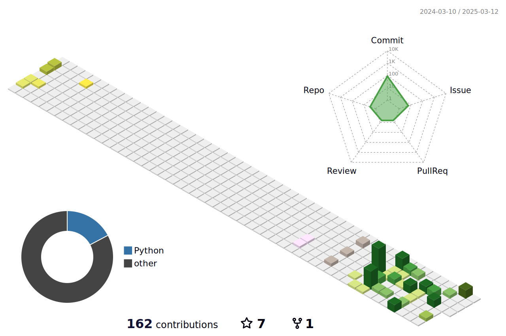

  
  
&nbsp;

  <!-- profile logo badges -->
  

    &emsp;
    &emsp;
    &emsp;
    &emsp;
    <!-- visitor statistics badge -->
    
  

  <b>English</b> | <a href="README_zh.md">简体中文</a>

---

### 🧙‍♂️ About Me

> Visit my [Personal Website](https://eohan.me/) for more about my work and research.

- 👋 Hi, I’m Eohan, a first-year Ph.D candidate at [Shanghai Jiao Tong University](https://www.sjtu.edu.cn/), prior to that I earn my bachelor’s degree at [Central South University](https://www.csu.edu.cn/)
- 💭 My research interests: Embodied Intelligence (recent focus), AI Agents, Multimodal Large Language Models(MLLMs), and Deepfake Detection (Previous Works).
- 📢 Seeking like-minded partners for Open Source or Academic Research Collaboration. Contact: [gnonymous.ai@gmail.com](mailto:gnonymous.ai@gmail.com).
- 🪁 Hobbies: Discussions, Community contributions, Singing.

---

### 🗂️ Featured Projects

  <table>
    <tr>
      <td width="50%">
          <a href="https://github.com/Gnonymous/Web-CogReasoner" target="_blank">
            
      </td>
      <td width="50%">
          <a href="https://github.com/Gnonymous/Simple-ChatBot" target="_blank">
            
      </td>
    </tr>
    <tr>
      <td width="50%">
          <a href="https://github.com/Gnonymous/Simple-MLLM" target="_blank">
            
      </td>
      <td width="50%">
        

          <h3 align="center">More Projects</h3>
          
        

      </td>
    </tr>
  </table>

---

### 🏆 Honors & Experiences

| Time | Achievements | Category |
|------|-------------|----------|
| [2025.02] | **Provincial Outstanding Graduate**: Honored with Outstanding Graduate of Hunan Province Class of 2025 (Provincial Level, 18 Recipients, Top 3%) |  |
| [2024.12] | **National Scholarship**: Honored with National Scholarship for the 2023-2024 academic year (Top 1%) |  |
| [2024.12] | **Special Scholarship**: Honored with [Central South University](https://csu.edu.cn/) Special Scholarship for the 2023-2024 academic year (Top 1% & Only 1) |  |
| [2024.09] | **Direct Ph.D Admission**: Having been admitted to [Shanghai Jiao Tong University](https://en.sjtu.edu.cn/) |  |
| [2024.08] | **DeepShield**: 🎉 Congratulations to our project "Deepshield, A Robust Defense Against Deepfake" for winning the **National Second Prize(Top 6-10%)** in the [National College Student Information Security Competition](http://117.78.33.202/announcement/view/364)(Totally 852 teams participated). |  |
| [2024.05] | **Research Intern**: At [University of Michigan-SJTU Joint Institute](https://www.ji.sjtu.edu.cn/): Exploring MLLMs in Human-Vehicle Dialogue. |  |
| [2024.03] | **Paper Accepted**: 🎉 Congratulations to our Paper "[Multi-strategy Adversarial Learning for Robust Face Forgery Detection under Attacks](https://ieeexplore.ieee.org/abstract/document/10688131)" has accepted to ICME 2024 as Oral Paper (CCF-B Conference). |  |
| [2024.03] | **Provincial Innovation Project**: 🎉 Congratulations to our project for receiving funding from [College Student Innovation Project in Hunan Province](http://114.220.75.43:1021/hncxcy), which was awarded "Outstanding Project & Paper" among 4 other accolades. I'm the **leader** of this project. |  |
| [2022-2024] | **Excellent Student & Cadre**: Honored with Excellent Student and Excellent Student Cadre of [Central South University](https://csu.edu.cn/)(Totally 800+ students in the grades). |  |
| [2022.12] | **National Scholarship**: Honored with National Scholarship for the 2021-2022 academic year (Top 1% & Only 1) |  |

---

### 📊 GitHub Stats

  <!-- 活动时间轴 -->
  

 

  

  <h3>Connect With Me</h3>
  
  
  
  
&nbsp;

  

    
  

  

